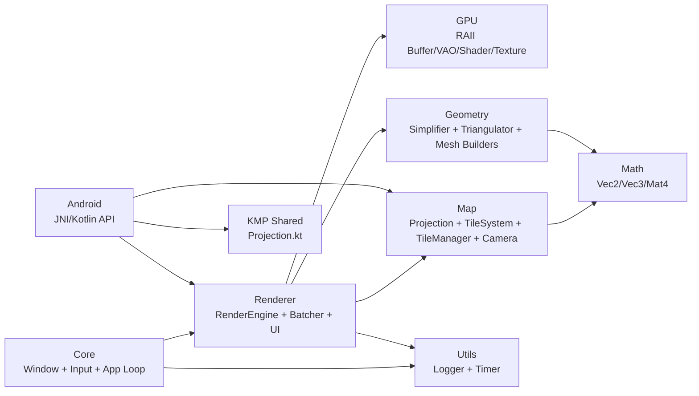
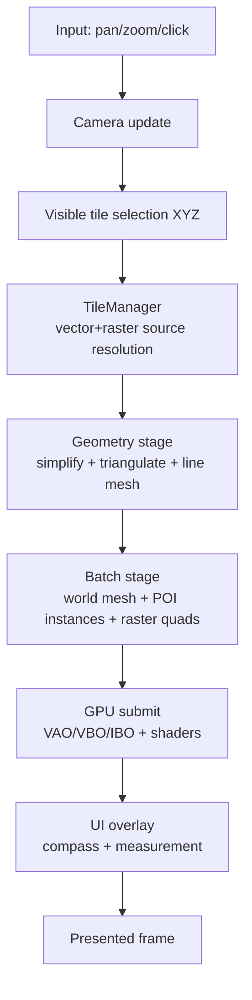
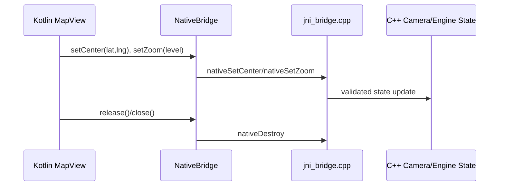
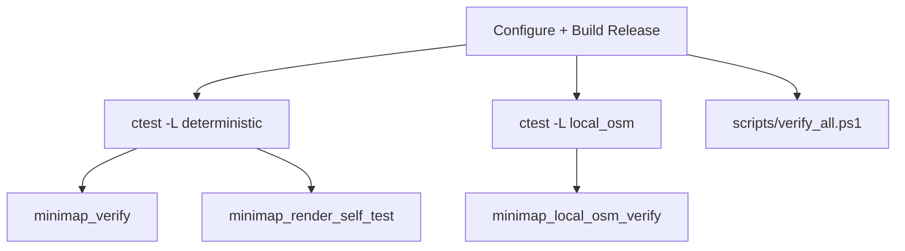

# Mini Map Rendering Engine

Production-quality C++20 mini map rendering system using OpenGL 3.3, with modular architecture, robust verification lanes, local OSM ingestion, swappable raster providers, Android JNI bridge, and KMP shared projection math.

## Architecture

### Module Topology



### Runtime Render Flow



### Android/JNI Bridge Flow



## Project Structure

| Area | Path | Purpose |
|---|---|---|
| Core | `src/Core` | Lifecycle, GLFW window/context, input plumbing |
| Renderer | `src/Renderer` | Orchestration, batching, UI overlay, zoom/stability logic |
| GPU | `src/GPU` | RAII OpenGL wrappers |
| Map | `src/Map` | Projection, tile logic, providers, snapping, distance/bearing |
| Geometry | `src/Geometry` | Douglas-Peucker, triangulation, mesh generation |
| Math | `src/Math` | Matrix/vector primitives |
| Utils | `src/Utils` | Logging and timing |
| Shaders | `shaders` | GLSL for world/raster/POI/UI |
| Tests | `tests` | Deterministic and local-OSM verification |
| Android | `android` | JNI library + Kotlin API |
| KMP | `shared` | Shared projection math |
| CI helper scripts | `scripts` | One-command verification |

## Feature Status

| Feature | Status | Notes |
|---|---|---|
| Web Mercator (`EPSG:3857`) | Implemented | Lat/Lng <-> world <-> screen transforms |
| Multi-zoom tiling | Implemented | XYZ tile bounds + visible tile selection |
| Smooth zooming | Implemented | Continuous zoom math, stable local OSM hysteresis |
| Raster/vector source switching | Implemented | `synthetic`, `local_osm`, `osm`, `auto` |
| Polyline + polygon rendering | Implemented | World-space width conversion + triangulation |
| Distance + bearing + compass | Implemented | Snapped measurement endpoints |
| POI GPU instancing | Implemented | Single instanced draw path |
| OSM raster async loading | Implemented | Background downloader + cache-hit refresh |
| Local OSM parser | Implemented | Roads, areas, POIs from `map.osm` |
| Android JNI API | Implemented | `MapView.setCenter`, `MapView.setZoom`, `release/close` |
| KMP shared math | Implemented | `shared/.../Projection.kt` |

## Configuration

| Variable | Values | Default | Behavior |
|---|---|---|---|
| `MINIMAP_VECTOR_SOURCE` | `synthetic`, `local_osm`, `auto` | `auto` | Chooses vector provider |
| `MINIMAP_OSM_FILE` | file path | `maps/map.osm` | Local OSM XML source |
| `MINIMAP_RASTER_SOURCE` | `synthetic`, `osm`, `auto` | `auto` | Chooses raster provider |
| `MINIMAP_TILE_CACHE` | dir path | `.tile_cache` | Raster PNG cache |
| `MINIMAP_OSM_URL` | URL template | OSM standard URL | Raster endpoint `{z}/{x}/{y}` |

## Build

### Desktop (Windows/Linux)

```bash
cmake -S . -B build -DMINIMAP_BUILD_DESKTOP=ON -DMINIMAP_BUILD_ANDROID=OFF -DMINIMAP_ENABLE_STRICT_WARNINGS=ON
cmake --build build --config Release
```

Run:

- `build/Release/minimap_demo.exe` (Windows)
- `build/minimap_demo` (Linux)

### Android (JNI/NDK)

The Android module now bootstraps the core engine via `android/CMakeLists.txt` by adding the repository root as a CMake subproject, with recursion guards for `MINIMAP_BUILD_ANDROID`.

Android Gradle module:

- `android/build.gradle.kts`
- JNI library target: `minimap_android`
- Kotlin API: `android/src/main/java/com/example/minimap/MapView.kt`

## Controls

- Left drag: pan
- Mouse wheel: zoom
- Right click (1): snapped point A
- Right click (2): snapped point B + distance/bearing update

## Verification

### Test/Verification Pipeline



### Commands

```bash
ctest --test-dir build -C Release --output-on-failure
ctest --test-dir build -C Release --output-on-failure -L deterministic
ctest --test-dir build -C Release --output-on-failure -L render
ctest --test-dir build -C Release --output-on-failure -L local_osm
powershell -ExecutionPolicy Bypass -File scripts/verify_all.ps1
build/Release/minimap_demo.exe --visual-verify
```

Latest full pass summary:

```text
100% tests passed, 0 failed
deterministic lane: PASS
local_osm lane: PASS
self-test: SELF_TEST_PASS with non-trivial frame hash diversity
```

## Release Gates (Critical 3)

| Gate | Acceptance Criteria | Status |
|---|---|---|
| Architecture & organization | Strict module boundaries, no monolithic files, clear responsibility split | Pass |
| Graphics correctness | Correct transforms, stable compass, no raster pinning/whiteout, robust source switching | Pass |
| Performance awareness | Batched geometry + POI instancing + async raster + stabilized local OSM warmup | Pass |

## Full Issue Log and Fixes

| Issue | Symptom | Root Cause | Final Fix |
|---|---|---|---|
| Stepped zoom | Zoom felt jumpy | Integer zoom used in scaling path | Continuous zoom resolution path |
| Tests close immediately | Hard to visually validate | No persistent visual mode | Added `--visual-verify`, `--self-test-visible`, `--pause` |
| Compass clipping/orientation | Arrow clipped/wrong direction | Anchor too tight + sign mismatch | Inset and corrected heading sign |
| Raster appears pinned | Tile image detached from world | Screen-space raster path | World-space per-tile raster quads |
| Whiteout at max zoom | Scene fades to white | Blend limits forced near-zero alpha | Clamp guard at zoom limits |
| Raster aliasing across tiles | Neighbor tiles looked identical | Single shared raster texture | Per-tile texture cache + tile-id keyed binding |
| OSM raster not refreshing | Stale checker after first miss | Tile cache never reloaded | Cache-hit revalidation after async download |
| Scroll/zoom freezing | Stalls during tile loading | Sync network fetch and heavy in-frame work | Async downloads + clipping/decimation |
| Local OSM popping | Features appeared/disappeared across zoom | Dual-layer crossfade instability | Local stable single-layer mode + hysteresis |
| Coverage holes during warmup | Missing areas while loading | Build budget skipped uncached tiles | Transient fallback mesh path |
| Startup jitter/vibration | Roads shake briefly on initial load | Mesh detail mismatch and slow early cache fill | Unified simplification epsilon + startup prewarm budget |
| Local OSM culling inconsistency | Roads/areas not fully covered | Tight tile-local generation and budget interactions | Expanded bounds handling + fallback rendering path |
| Android native build fragility | Gradle CMake depended on implicit setup | Android CMake didn’t bootstrap core project explicitly | `add_subdirectory(..)` root bootstrap with recursion guards |

## Cleanup Performed (Final Pass)

- Removed transient artifacts:
  - deleted generated verification CSV reports from workspace root
  - removed debug media folders: `video_review*`
  - removed `build_strict` directory
- Hardened Android ownership/lifecycle:
  - `MapView` now supports `AutoCloseable` (`close` + `release`)
  - JNI setters now synchronized with the same native mutex as destroy
- Hardened Android CMake integration:
  - Android CMake now explicitly includes root engine project with safe flags
- Preserved only production source, shaders, build scripts, tests, and required assets.

## Remaining Tradeoffs

- Cartographic style is intentionally simple; not full OSM cartography.
- Local OSM parser targets common tags and can be extended for richer thematic styling.

## AI Tools Used

| Activity | Tool |
|---|---|
| Coding, refactoring, scripts, runtime/testing loops | Cursor |
| Project planning and implementation strategy | ChatGPT |

## AI Disclosure

AI-assisted development was used for implementation and validation orchestration. All runtime and correctness claims were validated by local build/test/visual verification flows listed above.
